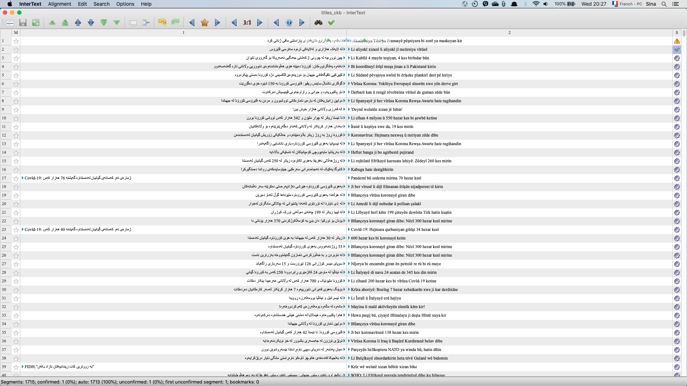
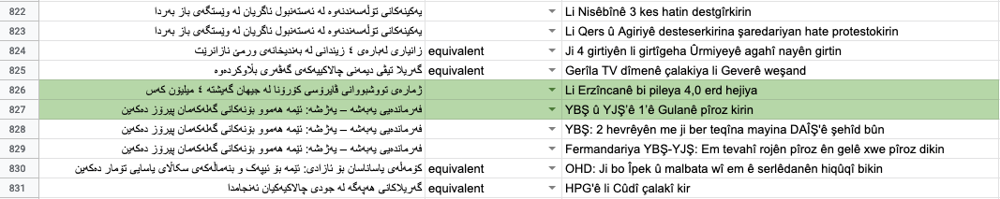

# Parallel Corpus Alignment for Kurdish
### April 2020
### [Sina Ahmadi](https://sinaahmadi.github.io/) (ahmadi.sina@outlook.com)

## Objectives
Aligned [corpora](https://en.wikipedia.org/wiki/Text_corpus) are essential resources with various applications in natural language processing, particularly in [Machine Translation](https://en.wikipedia.org/wiki/Machine_translation). [Kurdish](https://en.wikipedia.org/wiki/Kurdish_languages), as a less-resourced language, lacks large parallel corpora which are required for further progress in creating statistical and neural machine translation systems. To tackle this problem in a viable way, we are aiming at creating a large [parallel text](https://en.wikipedia.org/wiki/Parallel_text) for Kurmanji and Sorani dialects of Kurdish and extend it to include Kurdish-English translations.

## Task definition
Given two sets of candidate sentences in Sorani and Kurmanji (or any two other dialects or languages), the task of alignment is consisted of **verifying** whether two candidate sentences are equivalent or not. Focusing on news articles, the task of alignment is carried out at two levels:

* **Document-level alignment**: In this task, given a headline in Sorani, a set of news headlines in Kurmanji are provided which are potentially identical. We use various filtering techniques to provide the most probable headlines using the publication dates, tags, and distinct hyperlinks (such as ). If two headlines are identical, they are confirmed as parallel translations, otherwise, they should be ignored. It is also possible to move the headlines if you happen to remember a previous match. 

* **Sentence-level alignment**: Once the headlines aligned, the corresponding content of each article is provided for the same alignment task. The task will be slightly easier as the set of possible combinations for each news article does not exceed 10 parallel paragraphs, usually. 

The following shows an example of the matching scenario:

| Sorani | Kurmanji | 
| ------------- |:-------------:| 
| وەزیری دەرەوەی ئەمریکا: کشاندنەوەی پاتریۆت گوشار نییە بۆ سەر سعودیە | Pompeo: Vekêşandina sîstema Patriot ne givaşe Ii ser Siûdiyê |
| وەزیری دەرەوەی ئەمریکا: کشاندنەوەی پاتریۆت گوشار نییە بۆ سەر سعودیە | Wezîrê derve yê Amerîkayê ji bo serdanekî geheşt Îsraîlê |
| وەزیری دەرەوەی ئەمریکا: کشاندنەوەی پاتریۆت گوشار نییە بۆ سەر سعودیە | Wezîrê derve yê Amerîkayê desthilatdarên Îranê wek Naziyan | pênase dike  |
| وەزیری دەرەوەی ئەمریکا: کشاندنەوەی پاتریۆت گوشار نییە بۆ سەر سعودیە | Brezîlya- Wezîrê Tendirustiyê dev ji erka xwe berda |
| وەزیری دەرەوەی ئەمریکا: کشاندنەوەی پاتریۆت گوشار نییە بۆ سەر سعودیە | Cîgirê serokê Amerîkayê ket karantînayê |

where for one headline in Sorani in left, possible headlines in Kurmanji are provided. The first Kurmanji headline should be confirmed as the translation of the Sorani text.

For the alignment task, we use [InterText](https://wanthalf.saga.cz/intertext), an annotation program that facilitates the alignment and the conversion of the data. The following is a screenshot of the program. Please follow the instructions to install it and make sure that you check the [user guide](https://wanthalf.saga.cz/repository/intertext/InterText_Editor-User_Guide-doublesided.pdf). Alternatively, you can use spreadsheets for the same purpose. This is up to you. 

  

## What is a valid translation?
Given that our data are based on news articles, there are many editorial aspects that might affect the translation content. As our task is translation and linguistic validation rather than manual translation, it should be noted that we follow a few principals, among which the followings:

1. conceptual equivalence: do the two phrases/sentences refer to the same thing?
2. logical validity: are the two sentences sound with respect to what they try to convey?
3. syntactic validity: is the sentence comprehensible for a native?
  

As long as a translation pair conforms with these principles, they can be considered a valid translation. In the case where you are sure that a pair is identical translations in Sorani and Kurmanji but they do not conform to these principles, please toggle the confirmation status as illustrated with the danger triangle.
A few examples for valid translations:

| Sorani | Kurmanji | Status |
| ------------- |:-------------:| --- |
| باڵیۆزی چین لە ئیسرائیل بە مردوویی لە شوێنی حەوانەوەکەیدا دۆزرایەوە | Sefîrê Çînê yê li Israîlê li malê mirî hate dîtin| ✅ |
| بە هۆی گەردەلوولی گەورە لە ئەمریکا زیاتر لە 22 کەس گیانیان لەدەست  | Koalîsyona Navneteweyî li Heşdî Şebî da: 26 kes mirin | ❌  |
| دەرهێنەری فیلمی کچانی خۆر: «ژن - ژیان - ئازادی» نیشانەی فەلسەفەی ئۆجالانە | Hûsson: Jin, jiyan, azadî nîşaneya felsefeya Ocalan e| ✅ |
| دەرهێنەری فیلمی کچانی خۆر: «ژن - ژیان - ئازادی» نیشانەی فەلسەفەی ئۆجالانە | Derhêner Hûsson: Ocalan hêzê dide jinan |  ❌ |
| لە شاری سلێمانی یادی کەریم کابان کرایەوە | ‘Dengbêjî dîroka zindî ye’ | ❌ |
| کەنەکە: زمان مەرجێکى سەرەکیى بوونمانە و جەژنی زمانى کوردی پیرۆز بێت | KNK'ê Cejna Zimanê Kurdî pîroz kir |  ⚠️  |

In the last example, the news articles should be checked as they might be parallel translations with slightly different headlines.

Please watch this video if you are new to InterText: [https://www.youtube.com/watch?v=8OSHkF56H8Q](https://www.youtube.com/watch?v=8OSHkF56H8Q)

If you are not sure about a translation pair, you can check the provided JSON file to find the complete news article (open the JSON file with your browser for a better search performance). Or alternatively, you can google it and find the original page. 
In the spreadsheet, there are two options available for each row: 
* Equivalent: which indicates that the two headlines are exactly parallel and you are sure about it
* Possible: you are sure that the headlines refer to the same news article (after checking the JSON file) but you also notice that the translations are not equivalent or one is conveying a completely different message. For instance, the following are the headlines of two identical new articles but are not exact translations: 

| Sorani | relation | Kurmanji | 
| ------------- |:-------------:| --- |
| کابوگا یەکێک لە ئەنجامدەرانی سەرەکیی جینۆسایدەکەى رواندا دەستگیرکرا | possible | Kabuga hate destgîrkirin |
| هونەرمەندانی کەرکووک داوا دەکەن بایەخی زیاتر بەهونەربدرێت | possible | Li Kerkûkê nirx nadin hunerê |
	

The reason that we still want to keep such cases is that they will enable us to retrieve the news articles. However, we will not use “possible” headlines in the final dataset as a translation pair.

This is how the Sorani headlines are aligned with the Kurmanji ones. Once a Sorani headline is aligned, the other provided suggestions can be skipped without further reading.

| Sorani | relation | Kurmanji | 
| ------------- |:-------------:| --- |
| له‌ گوندێكی ناوچه‌ی برادۆست فێستیڤاڵی كەلەپوری و ھونەری بەڕێوەچوو | | Li Kobanê 3. komxebata Diyaloga Sûrî-Sûrî pêk tê |
| له‌ گوندێكی ناوچه‌ی برادۆست فێستیڤاڵی كەلەپوری و ھونەری بەڕێوەچوو | | Pêşangeha berxwedana Samiyan a li dijî mêtingeriyê |
| فیلمی 'بۆ ئازادی' لە هەژدەیەمین فیستیڤاڵی فیلمی جنێڤ نمایش دەکرێت | equivalent | Fîlmê ‘Ji bo azadiyê’ li 18. Festîvala Fîlm a Cenevreyê tê nîşandan |
| نووسه‌ری كوردی ئه‌رمه‌نستان «ئه‌مه‌ریكێ سه‌ردار» كۆچی دوایی كرد | equivalent | Rewşenbîrê Kurd Emerîkê Serdar çû ser dilovaniya xwe |
| فێستیڤاڵی پەلكەزێڕینه‌ی شیعر له‌ كۆیه‌ ساز كرا | | Li Kerkûkê 2. Festîvala Rewşenbirî û Hunerî hate lidarxistin |
| فێستیڤاڵی پەلكەزێڕینه‌ی شیعر له‌ كۆیه‌ ساز كرا | | Li Kerkûkê nirx nadin hunerê |
| فێستیڤاڵی پەلكەزێڕینه‌ی شیعر له‌ كۆیه‌ ساز كرا | | Li Reûtlîngenê çalakiya piştevaniyê |
| ڕیتمی چیا؛ گەریلا تۆڵه ڵدان | equivalent | Rîtma çiyê ya gerîla Tolhildan |
| ڕیتمی چیا؛ گەریلا تۆڵه ڵدان | | Festîvala Çanda Kurd a Skandînavyayê li Stockholmê pêk hat |
| ڕیتمی چیا؛ گەریلا تۆڵه ڵدان | | Hozanê ku temenê xwe dayî hunerê: Zulfî Yoldaş |
| ڕیتمی چیا؛ گەریلا تۆڵه ڵدان | | Hefteya Çandê ya Kurdistanê ya li Brukselê dewam dike |
| ڕیتمی چیا؛ گەریلا تۆڵه ڵدان | | Hefteya Çandê ya Kurdistanê li Brukselê dest pê kir |

More challenging cases in green where the two headlines are very similar but not equivalent:

### Deadlines (2020)

* Phase 1: Sorani-Kurmanji alignment
   * July 10th: deadline for headline alignment
   * August 2nd: deadline for content alignment
* Phase 2: Kurdish-English alignment
   * August 15th: deadline for headline alignment
   * September 30th: deadline for content alignment

For any inquiry regarding the task, you can reach out by mail.